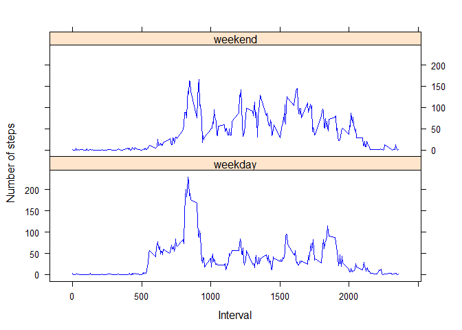

# Reproducible Research: Peer Assessment 1

```r
library("knitr")
```


```r
opts_chunk$set(echo=TRUE)
```

## Loading and preprocessing the data
1)Let's first unzip and read the data file into R.

```r
unzip("activity.zip")
dataset <-read.csv("activity.csv",na.strings = "NA")
```

## What is mean total number of steps taken per day?
1)The following is a histogram of the total number of steps taken each day.

```r
total_steps <- aggregate(steps ~ date, data = dataset, FUN= sum)
hist(total_steps$steps,col="orangered",main="Total number of steps taken each day",xlab="Number of steps",ylab="Frequency",ylim=c(0,35))
```

 


```r
mean <- round(mean(total_steps$steps))
median <- median(total_steps$steps)
```
2) The mean total number of steps taken per day is 1.0766\times 10^{4},rounded to the nearest integer. The median total number of steps taken per day is 10765.

## What is the average daily activity pattern?
1)The following is a time series plot of the 5-min interval(x-axis),and the average number of steps taken, averaged across all days (y axis).

```r
avg_steps <- aggregate(steps ~ interval, data = dataset, FUN="mean") 
with(avg_steps,plot(interval,steps,type="l", col="blue",xlab="Interval",
ylab="Number of steps",main="Average number of steps taken daily"))
```

 


```r
interval <- avg_steps[avg_steps$steps==max(avg_steps$steps),]$interval
priorinterval <- interval-5
```
2)The 5 minute interval which contains the maximum number of steps,on average across all days in the dataset, is between 830 and 835.

## Imputing missing values

```r
missingvalues <- nrow(dataset[is.na(dataset$steps),])
```
1)The total number of missing values in the dataset is 2304.

2)The following code summarises the strategy for filling in all missing values in the dataset.The strategy is to use the mean number of steps for that 5 minute interval,averaged across all days.

```r
dataset1<-dataset[is.na(dataset$steps),]
dataset2<-dataset[!is.na(dataset$steps),]
dataset3<- merge(dataset1,avg_steps,by="interval")
dataset4<-dataset3[,c(4,3,1)]
names(dataset4)<-c("steps","date","interval")
```
3)The following code creates a new dataset that is equal to the original dataset but with missing values filled in.

```r
dataset_new<-rbind(dataset4,dataset2)
dataset_new<-dataset_new[order(dataset_new[,2]),]
```
4)The following is a histogram of the total number of steps taken daily, using the new dataset with null values filled in.

```r
total_steps_new<- aggregate(steps ~ date, data = dataset_new, FUN= sum)
hist(total_steps_new$steps,col="orangered",
     main="Total number of steps taken each day", xlab="Number of steps",
     ylab="Frequency",ylim=c(0,40))
```

 


```r
newmean<-round(mean(total_steps_new$steps))
newmedian<-round(median(total_steps_new$steps))
```
The new mean total number of steps taken per day is 1.0766\times 10^{4},rounded to the nearest integer. The new median total number of steps taken per day is 1.0766\times 10^{4},rounded to nearest integer.

In comparison with the estimates in the earlier part of this assignment, the mean remains the same while the median changes slightly. The strategy of filling in missing values with the mean number of steps for that 5 minute interval, averaged across all days, naturally should not change the mean. However, naturally, the median should also move towards the mean.In this case, the new median equals the new mean.

## Are there differences in activity patterns between weekdays and weekends?
1)The following code inserts a new factor variable,indicating whether a date is a weekday or a weekend, into the new dataset with null values filled up.

```r
dataset_new$day <- weekdays(as.Date(dataset_new$date))
library("car")
dataset_new$day<-recode(dataset_new$day,"c('Monday','Tuesday','Wednesday','Thursday','Friday')='weekday';c('Saturday','Sunday')='weekend'")
dataset_new$day<-as.factor(dataset_new$day)
```

2)The following is the panel plot containing a timeseries plot of the 5- minute interval(x-axis)and the average number of steps taken, averaged across all weekday days or weekend days (y-axis)

```r
avg_steps_panel<-aggregate(steps~interval+day,data=dataset_new, FUN="mean")
library("lattice")
xyplot(steps~interval|day,data=avg_steps_panel,layout=c(1,2),ylab="Number of steps",xlab="Interval",type="l",col.line = "blue")
```

 
 
